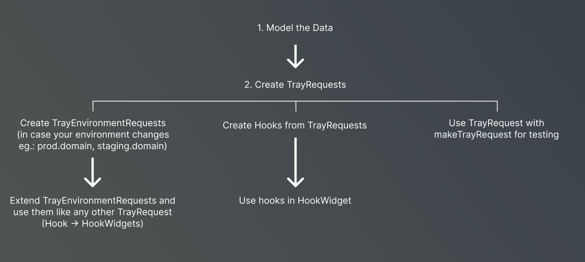

# fetch_tray

A library to abstract and help with HTTP API requests.
Strictly typed, flexible and fully testable.

It also includes simple `flutter_hooks` support.

## Overview

This libraries goal is to abstract every REST endpoint into it's own `TrayRequest` class, that defines all the basic information, so it can just be used by calling `makeTrayRequest` with the specific endpoint TrayRequest class combined with the needed `params`, `headers` and `body` parameters.

## Documentation

- [Getting Started](./doc/advanced/getting_started.md)
- [Pagination](./doc/advanced/pagination.mdd)
- [Testing](./doc/advanced/testing.md)

## Features

- Strictly typed
- TrayHooks
- TrayEnvironments
- Logging built in
- Error handling
- Fully Testable
- Pagination
<!-- - Caching -->

## ⚠ Warning: Still a work in progress

Although we use fetch tray in production already, the docs and some of the features are still in development!
We appreciate any support and PRs.

## Breaking changes not in README

// TODO: Change requests to include RequestType instead of only ResponseType definition

### Testing your models, requests, hooks

FetchTray is fully testable and makes it very easy to set everything up.
[How to test](./doc/advanced/testing.md)

## Contributing

We are looking forward to contributions, bugfixes, documentation improvements, ... for this package.
Please provide descriptive information in your pull requests and make sure to write tests and respect and address linting problem before you do so.

We will review and merge PRs.

## TODO

- [ ] change documentation to reflect custom metadata type changes
- [ ] add tests for `refetching` and `fetchMore`
- [ ] add docs for `lazyRun` parameter and post hooks
- [ ] add docs POST (requestBody) behavior [example is currently in `tests/create_mock_user_request.dart`]
- [ ] add docs fetching a list of entities [example is currently in `tests/fetch_mock_user_list_request.dart`]
- [ ] prepare example folder with full example
- [ ] create example application
- [ ] add docs about customizing error handling (overwriting `parseErrorDetails` in `TrayEnvironment`)
- [ ] add possibility of adding a caching driver
- [ ] create a caching driver using riverpod with global state management
- [ ] create a caching driver using hive for offline support
