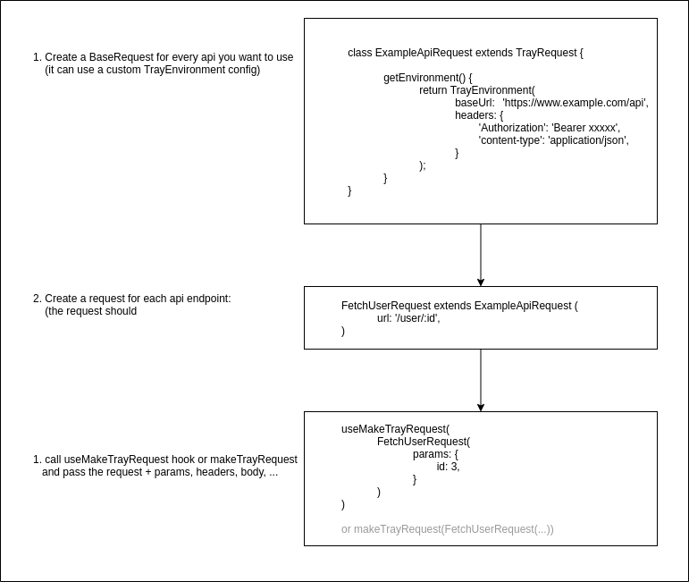

# fetch_tray

A library to abstract and help with HTTP API requests.
Strictly typed, flexible and fully testable.

It also includes simple `flutter_hooks` support.

## ⚠ Warning: Still a work in progress

Although we use fetch tray in production already, the docs and some of the features are still in development!
We appreciate any support and PRs.

## Getting started

Start by adding the package to your `pubspec.yaml`:

```yaml
dependencies:
  fetch_tray: ^0.0.3
```

Run pub get to install dependencies:

```bash
flutter pub get
```

## How it works

### Overview

This libraries goal is to abstract every REST endpoint into it's own `TrayRequest` class, that defines all the basic information, so it can just be used by calling `makeTrayRequest` with the specific endpoint TrayRequest class combined with the needed `params`, `headers` and `body` parameters.


### Real life example

Let's assume we have a user overview (list of users) and a user detail page.
Each `user` has the following attributes:

* id
* email
* name

### Creating the model

The first thing we need to do, to have nice output types is define the output type (we call it  `Model`):

Let's create a `user.dart` file with the following class.

```dart
/// user.dart
class User {
  final int id;
  final String email;
  final String? name;
  final DateTime? signupDate;

  // we need to define a constructor, that let's fetch_tray create the model easily
  const User({
    required this.id,
    required this.email,
    this.name,
    this.signupDate,
  });

  // and every model needs the `fromJson` method, to make sure we can parse the API json output
  // and create an instance of this model class out of it
  // this is also the place, where you could make transformations between your API and flutter
  // (think like datetime conversions, ...)
  factory User.fromJson(Map<String, dynamic> json) {
    return MockUser(
      id: json['id'],
      email: json['email'],
      name: json['name'],
      signupDate: DateTime.parse(json['signupDate']),
    );
  }
}
```

## Creating the request

The next thing we need to do is creating a request for each API endpoint.
Every one of these request classes is going to be a "basic configuration" for each API endpoint within our application.

This gives us a good overview of all of the API endpoints, we really use.
And allows us to easily reuse API configuration classes, without having to repeat ourselves.

The goal of this is to just be able to call `makeTrayRequest()` and pass the configuration and everything is done, converted and validated in by `fetch_tray` for you.

So let's create our first `TrayRequest` class:

```dart
import 'package:fetch_tray/fetch_tray.dart';
// we first import the user model, we just created
import './user.dart';

// now we are going to create our class which is going to access the `/api/user/${userId}` endpoint
// we do this by extending the `TrayRequest` class, that contains some logic we need. And we pass our `User` model type to TrayRequest, to make sure eveything is typed correctly.
//
// We recommend to keep the naming convention and always adding `Request` at the end of this classname (this makes it easier to read and find)
class FetchUserRequest extends TrayRequest<User> {
  FetchUserRequest({
    // here you can define which params, you want to be definable, when making a request
    // if you want you could hardcode everything, if it is just a static url, then there would be no params here
    // in most cases though, you would expect some params, headers, body, hardcoded params, ...
    // but whatever really is here, is completely up to you and should just make using your Request easier or more customizable
    required int userId,
    Map<String, String>? params,
  }) : 
  // now whatever you pass here to super, will be passed to `TrayRequest` and therefore be part of the final configuration.
  // to check out what params are possible here, checkout the constructor of `TrayRequest`
  // only the `url` is really required
  // everything else is optional, and you could also go ahead and transform your input values into the values you are going to pass to super.
  // if you don't need any custom headers, body, params, ... you can also leave these fields out
  super(
          // the url is a required property.
          // this is going to be the API endpoint, that is called.
          // you can use placeholders in the form of `:PARAM_KEY`
          // if a `params` entry exists with this key, this will be replaced automatically by fetch_tray
          url: 'https://www.example.com/api/user/:userId',

          // the request method used in this request.
          // by default this is `GET`, but you can change it to `post`, `put`, `delete` as well.
          method: MakeRequestMethod.get,

          // as mentioned above the params are used to make every request call unique.
          // this way you can create one request to fetch users, but when you call it, you can 
          // change the user_id within the url.
          // 
          // if you use params, that match a placeholder in the API url above, they will be used within the path.
          // if they are not in the path, they will just be attached to the url as query params in the form `?paramKey=paramValue&...`
          params: {
            ...params,

            // here we use the hardcoded input value `userId` and just add it to the params
            // we could have also just expected the user to pass it to the params map directly,
            // but it is a lot more readable and understandable for everyone using the request 
            // class, if it is explicitly defined and required.
            // it's all about improving the `user experience` of the developer using your request methods.
            userId: userId,
          },
          
          // here we could pass request headers
          // In most cases, you don't want or need to expose this to the user of this request.
          // So as we do here: we are just defining a header, we know we are going to use, but 
          // don't give the user of this request a way to overwrite it.
          // if you want to do that though, just do the same as with the `params` above
          headers: {
            'Authorization': 'Bearer XXXXX',
          },

          // Since this is a GET request, we don't have a body, but for post requests, we can define a body as well.
          // see more about this in the `Post/Put` requests
          body: null,
        );

  // this part here is now very important
  // makeTrayRequest will fetch the data based on the configuration above.
  // But when the result is returned, it needs a way of associating the json with a model.
  // This is where this happens.
  // It is important, that this method with the name `getModelFromJson` always exists and does the // conversion as stated here.
  //
  // In most cases you only need to replace the Model name `User` with the one you are using and you should be fine. Everything else will be handled by `fetch_tray`
  @override
  User getModelFromJson(dynamic json) {
    return User.fromJson(json);
  }
}

```

### Making the request

Now that we have prepared our request method, it is time to just make the request and fetch the data we want to get.

To do this, we can use either the `makeTrayRequest` directly or use the `useMakeTrayRequest` flutter hook.

We prefer the latter, because it just uses `makeTrayRequest` under the hood, with some additional state aware logic.

The following logic can be placed wherever you want to fetch the data.
In your widgets, in your services, ... .

#### `makeTrayRequest` call

```dart
// main.dart
import 'package:fetch_tray/fetch_tray.dart';

// import the request and model
import './fetch_user_request.dart';
import './user.dart';

// initialize the `FetchUserRequest` with the specific configuration you need in this case
// the content of params or userId could also be a variable passed in this place.
final fetchUserRequest = FetchUserRequest(
  userId: 5,
  params: {
    'active': 'true',
  },
);

// now make the request (also pass the `User` model to the method, to make sure we have strict type safety)
final user = await makeTrayRequest<User>(fetchUserRequest);

// now you can just use and work it
print('The username: ${user.name}');
```

**Advanced options:**

```dart
  final user = await makeTrayRequest<User>(
    // the request class
    fetchUserRequest
    // debugLevel to get output in the console and debug requests, that are not working (by default will be the global setting in your TrayRequest
    // can also be used in the hooks the same way
    requestDebugLevel: FetchTrayDebugLevel.errors,
  );
```

#### `useMakeTrayRequest` hook

Use the `useMakeTrayRequest` hook, is very similar to `makeTrayRequest`, but a hook version:

```dart
// user_detail_screen.dart
import 'package:flutter/material.dart';
import 'package:fetch_tray/fetch_tray.dart';

// import the request and model
import './fetch_user_request.dart';
import './user.dart';


class UserDetailScreen extends HookWidget {
  const UserDetailScreen({
    Key? key,
    required this.userId,
  }) : super(key: key);

  static int userId;

  @override
  Widget build(BuildContext context) {
    // initialize the `FetchUserRequest` with the specific configuration you need in this case
    // the content of params or userId could also be a variable passed in this place.
    final fetchUserRequest = FetchUserRequest(
      userId: userId, // here we use the userid passed to the widget
      params: {
        'active': 'true',
      },
    );

    // now make the request (also pass the `User` model to the method, to make sure we have strict type safety)
    final userResponse = await useMakeTrayRequest<User>(fetchUserRequest);

    // if in loading state
    if (userResponse.loading) {
      return ActivityIndicator();
    }

    // if all the data is here -> use it
    return Text(userResponse.user?.name);
  }
}
```

### Creating a custom hook

If you have created a request, it is very easy to trigger it using the `useMakeTrayRequest` hook.
But we like clean and abstracted, so let's go one step further and create a custom hook for our requests.
This makes it even easier to use our requests and abstracts some of the typings and potential changes away.

It also allows us to create a unique and very developer friendly signature, of what input params are needed, required, ... .

Our hook will be very small, because it only calls the `useMakeTrayRequest` hook with the correct types under the hood.

```dart
// hooks/use_fetch_user_request.dart

import 'package:fetch_tray/fetch_tray.dart';
import '../requests/fetch_user_request.dart';

/// the request hook to fetch a single cause detail page
TrayRequestHookResponse<User> useFetchUserRequest<User>(
  int userId, {
  TrayRequestMock? mock,
}) {
  final fetchResult = useMakeTrayRequest<User>(
    FetchUserRequest(
      userId: userId,
    ),
    mock: mock,
  );

  return fetchResult;
}
```

## TrayEnvironments

The approach we used above pretty well, but the reason we use this library for is to reduce implementing logic over and over again.

Defining the full `api` url, headers, ... in every request works ok, if we only have a few requests and don't mind changing the baseUrl to often.

In most cases this is not viable though and we want to define these "almost static" parts of every request in one central location.

This is where `TrayEnvironments` come in.

They are basically nothing more than the basic configuration of every request.
In fact, by creating your `FetchUserRequest` above you extended the `TrayRequest` class, which creates a default `TrayEnvironment`.

## Overview of the process

Here is a quick overview of what we are going to do.



So basically our goal is to create our own `custom base request class` instead of `TrayRequest`.
This new `custom base request class` is going to define it's own `TrayEnvironment` with all the "static" request options, that all of our requests will build upon.

Then everyone of our requests will extend this `custom base request class` instead of the `TrayRequest` class by default and therefore get all the environment settings.

The good thing about this approach is, that we will have all the basic configuration details in one place, but still keep all the flexibility of having different API requests with different urls, headers, ... .

If you are polling multiple APIs for example, you could just create multiple environment `base request classes` and then in your `request class` extend the correct one.

## Creating a new `custom base request class`

```dart
// my_api_tray_request.dart

import 'package:fetch_tray/fetch_tray.dart';

class MyApiTrayRequest<ResultType> extends TrayRequest<ResultType> {
  // we have to pass all the props to the class above
  MyApiTrayRequest({
    required url,
    params,
    body,
    method = MakeRequestMethod.get,
    headers,
  }) : super(
    url: url,
    params: params,
    body: body,
    method: method,
    headers: headers,
  );

  // here we override the environment creation and just create our own custom environment
  // with all the details, that should be sent along with every request based on this 
  @override
  TrayEnvironment getEnvironment() {
    return TrayEnvironment(
      // this base url will be used as a postfix for all urls, we define in the requests themselves
      // so if the url in our request is `/api/users`, the final url in the request
      // will be `https://api.myapi.com/api/users`
      //
      // tip: ideally you put this url into a config value, that is only passed here
      baseUrl: 'https://api.myapi.com',

      // these headers will always be added to the headers, sent along with the request
      // if the request sends a header with the same key as one, that is defined here
      // the more specific request header value will be used
      headers: {
        'content-type': 'application/json',
        'Authorization': 'Bearer XXXXXXXX',
      },

      // these params will be added to every request
      // this is probably not used very often, but it is there in case you need it
      params: {
        'supersecrettoken': 'should_not_really_be_passed_here',
      },

      // defines the global log output, you want to show.
      // by changing this value you can:
      // 
      // - FetchTrayDebugLevel.none: Log nothing out (not even errors)
      // - FetchTrayDebugLevel.onlyErrors: Log only errors and fatal exceptions to console
      // - FetchTrayDebugLevel.errorsAndWarnings: Log all errors and warnings
      // - FetchTrayDebugLevel.everything: Log everything (errors, warnings, info) - this is great for debugging and fixing stuff, but probably too much, when you are working on something other than your requests.
      debugLevel: FetchTrayDebugLevel.errors,
    );
  }
}
```

### Creating our specific endpoint request

Now that we have our base environment, we can adjust the `FetchUserRequest` class and we will have to define less there:

```dart
// fetch_user_request.dart 

import 'package:fetch_tray/fetch_tray.dart';

// import our custom base request class
import './my_api_tray_request.dart';

// we first import the user model, we just created
import './user.dart';

// now instead of extending `TrayRequest` like we did above, we will extend our custom API request method.
// this will make sure our `FetchUserRequest` will inherit the TrayEnvironment we created.
class FetchUserRequest extends MyApiTrayRequest<User> {
  FetchUserRequest({
    required int userId,
    Map<String, String>? params,
  }) : 
  super(
          // instead of using the full url like before, we now only have to pass the path,
          // because the baseUrl is already set by our TrayEnvironment
          url: '/api/user/:userId',
          method: MakeRequestMethod.get,
          params: {
            ...params,
            userId: userId,
          },

          // we don't need the Authorization header here anymore, since it is set by our TrayEnvironment as well
          // headers: {
          //  'Authorization': 'Bearer XXXXX',
          // },
        );

  @override
  User getModelFromJson(dynamic json) {
    return User.fromJson(json);
  }
}

```

## Advanced topics

### Hooks

// TODO: add details about hooks like the `afterSuccess` hook

### Fetch more and pagination

See more in the [pagination section](./doc/advanced/pagination.md)

## Breaking changes not in README

// TODO: Change requests to include RequestType instead of only ResponseType definition

### Testing your models, requests, hooks

FetchTray is fully testable and makes it very easy to set everything up.
[How to test](./doc/advanced/testing.md)

## Contributing

We are looking forward to contributions, bugfixes, documentation improvements, ... for this package.
Please provide descriptive information in your pull requests and make sure to write tests and respect and address linting problem before you do so.

We will review and merge PRs.

## TODO

* [] add tests for `refetching` and `fetchMore`
* [] add docs for `lazyRun` parameter and post hooks
* [] add docs POST (requestBody) behavior [example is currently in `tests/create_mock_user_request.dart`]
* [] add docs fetching a list of entities [example is currently in `tests/fetch_mock_user_list_request.dart`]
* [] prepare example folder with full example
* [] create example application
* [] add docs about customizing error handling (overwriting `parseErrorDetails` in `TrayEnvironment`)
* [] add possibility of adding a caching driver
* [] create a caching driver using riverpod with global state management
* [] create a caching driver using hive for offline support
