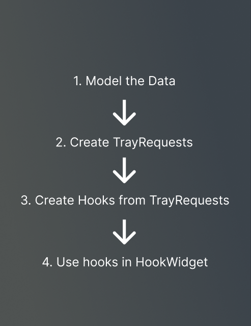
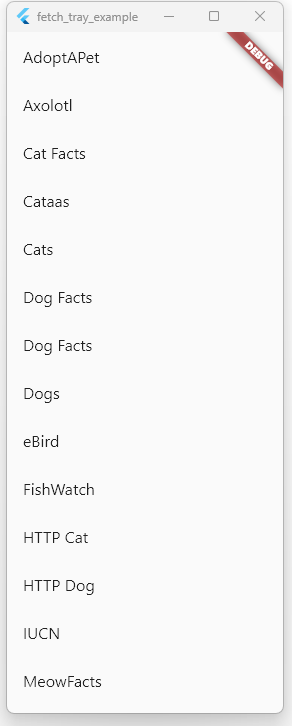
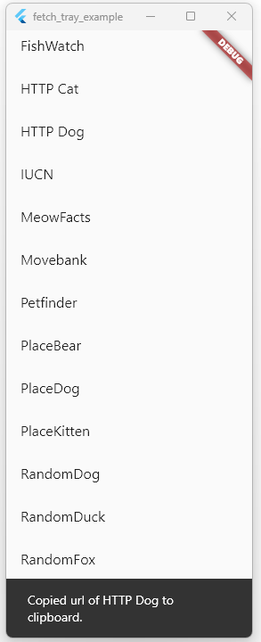

# Fetch Tray

## Getting started

Start by adding the package to your `pubspec.yaml`:

```bash
flutter pub add fetch_tray
```

Run pub get to install dependencies:

```bash
flutter pub get
```

Import the package in dart files:

```bash
import 'package:fetch_tray/fetch_tray.dart';
```

Check out our example project:
<https://github.com/marqably/fetch_tray/tree/main/examples/fetch_tray_example>

### Creating your FetchTrayHook



Lets fetch all the cool open APIs listed on <https://api.publicapis.org/> (<https://api.publicapis.org/entries>)

We can see that we get a json object back with a root object that contains the count and entries of our query.

In our case are only interested in the entries.

#### Creating the model

The data model of the API Objects is defined on the api documentation page.

```dart
// /data/domain/api.dart
class Api {
  final String? title;
  final String? description;
  final bool? https;
  final String? category;
  final String? link;

  Api({this.title, this.description, this.https, this.category, this.link});

  factory Api.fromJson(Map<String, dynamic> json) {
    return Api(
      title: json["API"],
      description: json["description"],
      https: json["HTTPS"],
      category: json["Category"],
      link: json["Link"],
    );
  }
}
```

#### Creating the request

Now to the fun part, we create our first request! :D

```dart
// data/requests/fetch_apis_request.dart
import 'package:fetch_tray/fetch_tray.dart';
import 'package:fetch_tray_example/data/domain/api.dart';

class FetchApisRequest extends TrayRequest<List<Api>> {
  FetchApisRequest({
    required int userId,
    Map<String, String>? params,
  }) : super(
          // Here we pass in all the configuration we need to make the reuqest
          // In this case we request a list of all the API entries from publicapis.og
          url: 'https://api.publicapis.org/entries',
          method: MakeRequestMethod.get,
          params: {
            // ...params,
            // userId: userId,
          },
          headers: {
            // 'Authorization': 'Bearer XXXXX',
          },
          body: null,
        );

  @override
  List<Api> getModelFromJson(dynamic json) {
    final List<dynamic> entries = json['entries'];
    return entries.map((e) => Api.fromJson(e)).toList();
  }
}
```

#### Creating the Hook

Now we can use the TrayRequest in the `useMakeTrayRequest` hook

```dart
// data/hooks/use_fetch_apis.dart
import 'package:fetch_tray/fetch_tray.dart';
import 'package:fetch_tray_example/data/domain/api.dart';
import 'package:fetch_tray_example/data/requests/fetch_apis_request.dart';

typedef FetchApisHookReturnType
    = TrayRequestHookResponse<FetchApisRequest, List<Api>, TrayRequestMetadata>;

FetchApisHookReturnType useFetchApis(
    // Here we pass in all the configuration we need to make the reuqest
    ) {
  return useMakeTrayRequest<FetchApisRequest, List<Api>, TrayRequestMetadata>(
      FetchApisRequest());
}
```

#### Using the Hook in HookWidgets

Use the `useMakeTrayRequest` hook:

```dart
// lib/main.dart
import 'package:fetch_tray/fetch_tray.dart';
import 'package:fetch_tray_example/data/hooks/use_fetch_apis.dart';
import 'package:flutter/material.dart';
import 'package:flutter/services.dart';
import 'package:flutter_hooks/flutter_hooks.dart';

void main() {
  runApp(const MyApp());
}

class MyApp extends StatelessWidget {
  const MyApp({super.key});

  @override
  Widget build(BuildContext context) {
    return MaterialApp(
      title: 'Flutter Demo',
      theme: ThemeData(
        primarySwatch: Colors.blue,
      ),
      home: const MyHomePage(title: 'Flutter Demo Home Page'),
    );
  }
}

class MyHomePage extends HookWidget {
  const MyHomePage({super.key, required this.title});
  final String title;

  @override
  Widget build(BuildContext context) {

    // Here we create an instance of our Hook:
    final fetchApisHook = useFetchApis();

    // We can then check for different state of the request by accessing the TrayRequestHookResponse
    if (fetchApisHook.loading) {
      return const Scaffold(
        body: Center(
          child: CircularProgressIndicator(),
        ),
      );
    }

    // Our data will be in the .data property
    if (fetchApisHook.data != null) {
      return Scaffold(
        body: ListView.builder(
          itemBuilder: (context, index) {
            return ListTile(
              onTap: () {
                Clipboard.setData(
                  ClipboardData(text: fetchApisHook.data![index].link),
                ).then(
                  (value) => ScaffoldMessenger.of(context).showSnackBar(
                    SnackBar(
                      content: Text(
                          'Copied url of ${fetchApisHook.data![index].title} to clipboard.'),
                    ),
                  ),
                );
              },
              title: Text('${fetchApisHook.data![index].title}'),
            );
          },
        ),
      );
    }

    // If we have an error we can access it in the .error property
    if (fetchApisHook.error != null) {
      return const Scaffold(
        body: Center(
          child: Text('Error'),
        ),
      );
    }

    // In case something comepletly went wrong
    return const Scaffold(
      body: Center(
        child: Text('Something went wrong.'),
      ),
    );
  }
}
```

 
